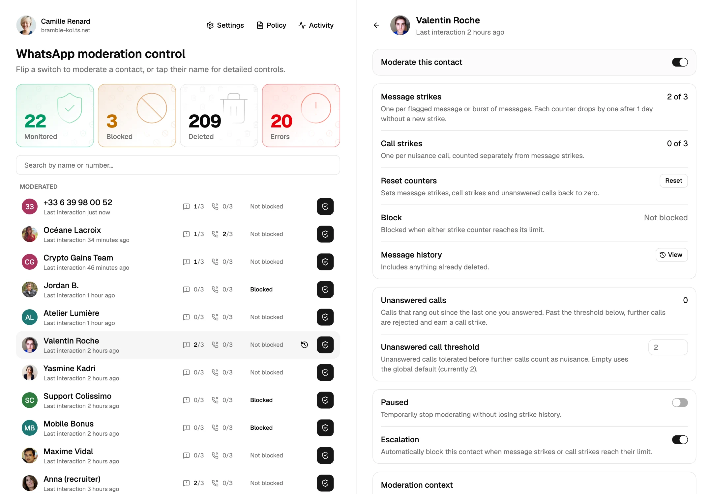
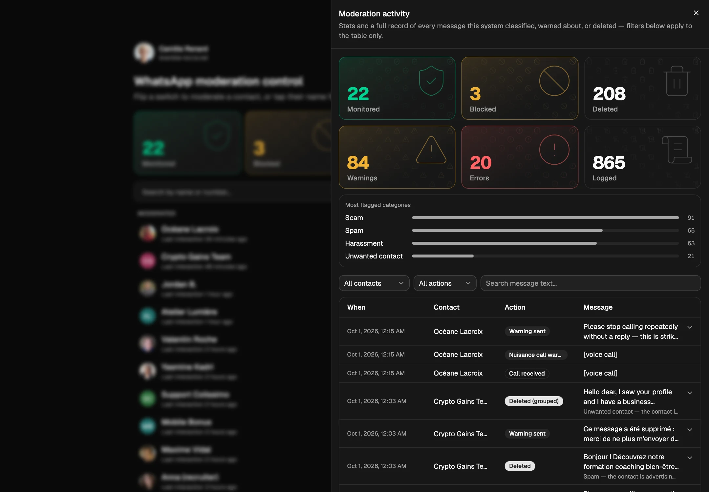
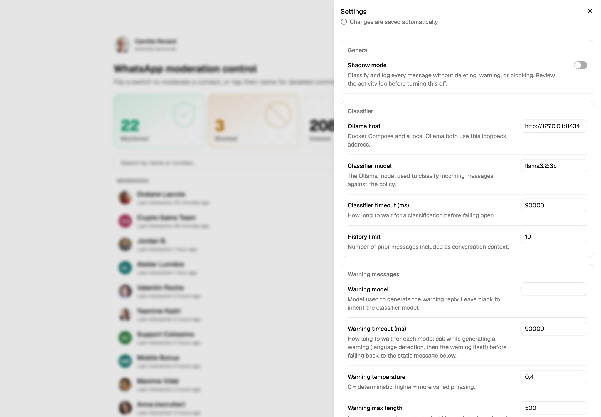
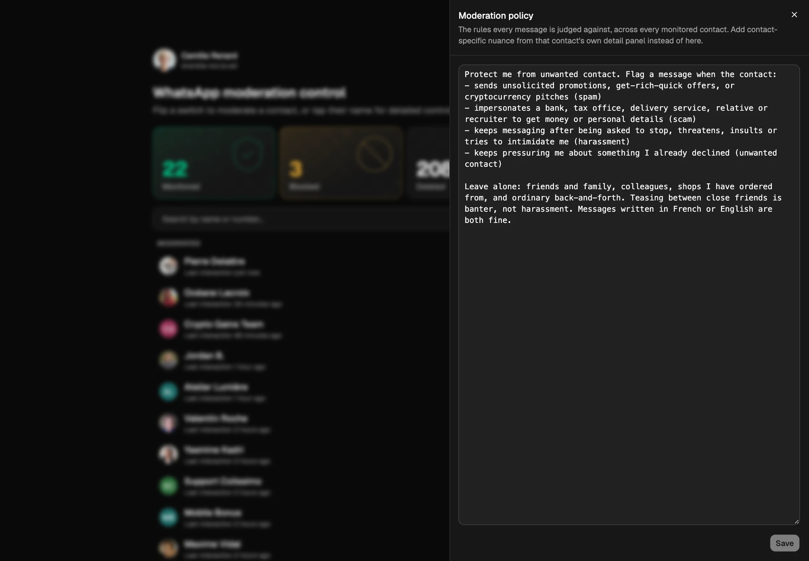
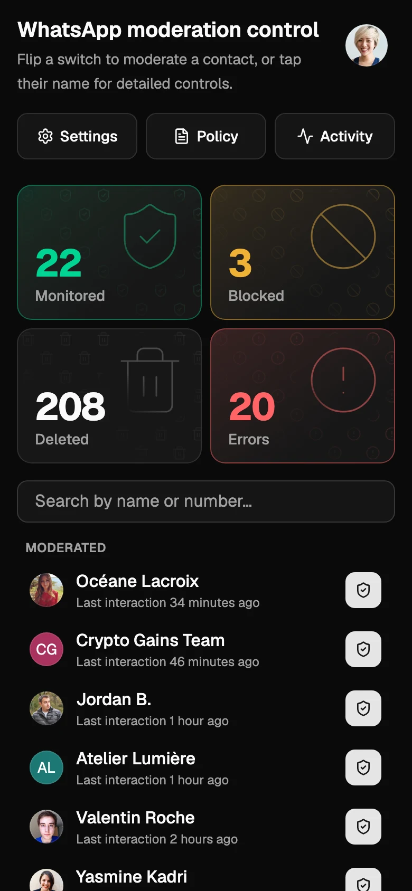

# WhatsApp-content-moderation

A localised, background-hosted "digital curtain" for a personal WhatsApp account. It links to the account as a headless companion device (via [Baileys](https://github.com/WhiskeySockets/Baileys)), runs incoming messages from an operator-chosen set of monitored contacts through an LLM classifier, deletes flagged messages locally ("delete for me"), sends a warning, and temporarily blocks a contact after repeated strikes (unless that contact has escalation turned off). Repeated unanswered calls from a monitored contact are handled the same way, independently of messages: past a configurable threshold, further calls are rejected and warned, escalating to a block.

## Screenshots

<p align="center">
  <picture>
    <source media="(prefers-color-scheme: dark)" srcset="docs/screenshots/overview-dark.webp">
    
  </picture>
</p>

<table>
  <tr>
    <td width="50%"><br><sub><b>Activity</b> — stats, flagged categories and the full audit log</sub></td>
    <td width="50%"><br><sub><b>Settings</b> — every tunable, editable live</sub></td>
  </tr>
  <tr>
    <td width="50%"><br><sub><b>Policy</b> — the rules, in plain language</sub></td>
    <td width="50%" align="center"><br><sub><b>Mobile</b> — the same app, on a phone</sub></td>
  </tr>
</table>

Every name, message and number in these is invented: they come from the [live demo](#live-demo), and `npm run --prefix web screenshots` regenerates them.

## Status

**Pre-release.** The moderation pipeline, block/unblock scheduler, manual override routines, and the multi-contact web control app are all built and have been validated against real WhatsApp accounts — see [`docs/decisions.md`](docs/decisions.md) for how, and for the full design history. This has **not** been run against a real contact for real moderation yet: the moderation policy is still the placeholder default. Leave shadow mode on (the default) and review its logs before pointing this at anyone — see [`docs/roadmap.md`](docs/roadmap.md) for the remaining checklist. Nuisance-call detection is newer and, unlike the rest, hasn't yet been confirmed against a real WhatsApp call — see [Validating nuisance-call handling](#validating-nuisance-call-handling) before relying on it.

## Quick start

Requirements: [Docker Compose](https://docs.docker.com/compose/install/) and a phone with WhatsApp, to scan a QR code the first time you link the account. Nothing else — no repo clone, no config files to write first.

```sh
mkdir whatsapp-moderation && cd whatsapp-moderation
curl -O https://raw.githubusercontent.com/BSoDium/WhatsApp-content-moderation/main/compose.yml
```

By default the control app this starts is reachable by anyone on your local network, with a warning banner on the page saying so. **This is the point to decide** whether that's fine for now, or whether to lock it down to one Tailscale identity first — see [Restricting access with Tailscale](#restricting-access-with-tailscale) below, which edits this same `compose.yml` before you start the container. Continue below either way.

```sh
docker compose up -d
docker compose exec ollama ollama pull llama3.2:3b
docker compose logs -f --no-log-prefix app   # scan the QR code shown here; Ctrl+C once connected
```

Open `http://<this-machine's-address>:4756` (`http://localhost:4756` on the same machine) and add a contact to the monitored roster — every incoming message from a monitored contact is now buffered, classified, and acted on. Everyone else is ignored.

Everything else — the moderation policy, the classifier model, warning behavior, strike/block timings, and shadow mode itself — starts at a safe default and is edited live from that page, no restart needed. **Shadow mode is on by default**: the app classifies and logs but takes no action. Review the Activity panel against real traffic before turning it off in Settings.

No second WhatsApp number to test with? Add `TEST_ALLOW_SELF: "1"` under `environment:` in `compose.yml` and add your own account to the roster instead.

To update later: `docker compose pull && docker compose up -d`.

## Web control app

A small web app hosted by the same process (`src/web/`) — this is where contacts actually get moderated, and the only way to add one to the roster. A scrollable list shows every contact Baileys has learned about so far (a contact who's never messaged and isn't in your phone's synced address book will only show up as a bare number), searchable by name or number, each with a switch that directly turns moderation on/off. Clicking a contact (not the switch) opens a detail panel — message and call strikes, each shown against its threshold, block status, a pause switch, an escalation switch (turn off auto-blocking for a contact you can't afford to actually block — the rest of moderation still runs), an unblock button, a **Reset** button that zeroes message strikes, call strikes and the unanswered-call count (worth pressing after an unblock, or the very next flag re-blocks them instantly), a "Message history" link into the activity panel, an optional per-contact override of the nuisance call threshold, and (once monitored) a **moderation context** field: free text folded into the classifier prompt for that contact only, alongside the global policy, written as concrete criteria — see [Writing rules the classifier can follow](#writing-rules-the-classifier-can-follow). The page follows the OS/browser's light/dark preference automatically, and a banner stays visible while shadow mode is on. The header's status popover shows the WhatsApp connection state, the app version, and who you're signed in as.

- **Activity panel** — roster-wide stats (monitored count, active blocks, messages flagged/deleted, warnings sent, classifier errors, most-flagged categories) and a filterable, paginated explorer over every logged message, including anything already deleted, since the audit log is the only remaining record of it.
- **Policy** — the global moderation policy the classifier judges every message against. Starts as a placeholder that tells the classifier to flag nothing — write a real one here before trusting this with a real contact.
- **Settings** — every classifier/warning/strike/buffer/nuisance-call tuning knob, including shadow mode itself, grouped by area, saved on blur/toggle. Applies immediately.

### Auth model

Authenticated via Tailscale identity, not a password or shared secret — see [`docs/decisions.md`](docs/decisions.md#web-control-app-back-to-trusting-the-header-issue-29-twice-revisited) for the full reasoning. If `ALLOWED_TAILSCALE_LOGIN` isn't set, there's no auth at all: the app binds every network interface, and anyone who can reach the host on this port can open it — the header's user badge turns into an amber "Direct connection" warning that links here. Tailscale is the only access control: there's no password. This is the default so the app never refuses to start over a missing Tailscale login; see [Restricting access with Tailscale](#restricting-access-with-tailscale) to turn it on.

## Restricting access with Tailscale

Requires [Tailscale](https://tailscale.com) installed on the host, **with the host itself running under a tagged identity, not a personal login** — [Tailscale Services](https://tailscale.com/docs/features/tailscale-services) (the named-service mechanism this section sets up, in place of exposing the whole host under its own `<host>.<tailnet>.ts.net` name) require a tag-based device to act as a Service host. Tag it first if it isn't already — add a tag to `tagOwners` in your tailnet's ACL policy and run `sudo tailscale up --advertise-tags=tag:whatsapp-mod` (substitute your own tag).

Edit the `compose.yml` from the quick start above, before running `docker compose up -d`:

```yaml
services:
  app:
    environment:
      ALLOWED_TAILSCALE_LOGIN: you@example.com   # exactly what `tailscale status` reports for your own login
```

Add a grant in your tailnet's ACL policy so your login can reach the service (merge this into your policy's existing `grants`, and narrow `src` to your own login or a group instead of every member if you don't want the whole tailnet able to reach it):

```json
{
  "grants": [
    {
      "src": ["autogroup:member"],
      "dst": ["svc:whatsapp-moderation"],
      "ip": ["443"]
    }
  ]
}
```

**Define the Service in the [Tailscale admin console](https://console.tailscale.com/admin/services) before advertising it from the host** — a `tailscale serve --service=...` advertisement with no matching Service already defined has nowhere to attach to, and never shows up anywhere to approve (see [`docs/decisions.md`](docs/decisions.md#restricting-access-with-a-tailscale-service-replacing-the-hosts-own-hostname) for what that looked like, and for the other gotcha below). Click **Define Service** and fill in:

- **Service name**: `whatsapp-moderation` (must match the `svc:whatsapp-moderation` used everywhere else here)
- **Ports**: `443` — this is the port *tailnet clients* connect to `svc:whatsapp-moderation` on, not the app's own port. Getting this wrong (e.g. entering `4756`, the backend port) is what actually causes the "needs configuration" warning on the host once approved, not the approval itself.
- **Service tags**: leave blank — it's for grouping Services in ACL grants by tag, unrelated to which host is allowed to serve this one (that's the approval step below)

Then continue the quick start (`docker compose up -d`, pulling the model, scanning the QR code) and, once the app is running, advertise it as that Service:

```sh
sudo tailscale serve --service=svc:whatsapp-moderation --bg 4756
```

Back in the console, open the Service you defined — the host now shows up pending approval. Approve it there (not the Access Controls page). If a host was ever advertised *before* the Service existed and looks stuck, clear and re-advertise with a short delay so the daemon re-checks its approval status: `sudo tailscale serve clear svc:whatsapp-moderation`, wait a couple of seconds, then the `serve --service=...` command above again.

Open `https://whatsapp-moderation.<your-tailnet>.ts.net/` (the console's Services page shows the exact address) from a device signed in as the login the grant above allows. A visit from anyone else gets a 403 on every request. `src/web/control-server.ts` binds to `127.0.0.1` only in this mode, on purpose — it's reachable *only* through this proxy hop, now addressed by a stable service name instead of the host's own hostname, so the URL survives a host rename or a migration to different hardware. **This is deliberately single-factor**, accepted for a host where the operator is the only account with shell access to the machine — see [`docs/decisions.md`](docs/decisions.md#web-control-app-back-to-trusting-the-header-issue-29-twice-revisited) for what to do if that assumption doesn't hold for your setup (e.g. a shared or multi-user server).

## How it works

### Classifier

Uses a local [Ollama](https://ollama.com) model, bundled as a Compose service — no per-message API cost, runs entirely on the self-hosted machine. `llama3.2:3b` is the default (`docker compose exec ollama ollama pull llama3.2:3b`); change it, and the Ollama host, in the Settings panel. It was chosen over the cheaper `llama3.2:1b` after the smaller model proved unreliable under JSON-schema-constrained output — see [`docs/decisions.md`](docs/decisions.md) for the comparison.

Each verdict is structured JSON: who the message targets, whether it's mutual banter, and the flag itself. Mutual banter (the user teased first and the contact answered in kind) is let through, except for real threats, sexually explicit messages, pressure after a clear refusal, and any continuation of a message moderation already removed. The last few messages (**History limit**, 10 by default) are sent as context, including the user's own and earlier warnings.

**Fails open**: any Ollama error, timeout, or malformed response returns `{ ok: false }` rather than a guessed verdict — the message is left alone, never deleted, warned, or struck.

#### Writing rules the classifier can follow

A small model like `llama3.2:3b` matches concrete criteria and misses abstract ones. This applies to both the global policy and a contact's moderation context, so a rule that reads clearly to you can still never fire.

- Name the topics, words and requests to flag, including the words the contact would actually use (`mom, maman, mère`).
- Describe what the message *does* ("asks me to call her", "asks for moral support") rather than what it is *related to* or *feels like*.
- Keep each criterion separate, and say what to leave alone if a neighbouring topic keeps false-flagging.
- Test in shadow mode: send or replay real messages and read the Activity panel's verdict and reason before turning real actions on.

Example, on `llama3.2:3b`, for a contact whose messages about the operator's mother should be flagged:

| Rule | Result |
| --- | --- |
| `Any messages related to fixing up the relationship with my mom, or helping them get back in contact with her, should be flagged.` | Flagged none of the messages it was written for. |
| `Flag the message if it mentions my mother (mom, maman, mère), asks me to contact her, ask her to come back, or reconcile with her; or asks me for moral support, emotional help, or help with their mental health.` | Flagged messages naming her or asking her to come back, with no false positives on everyday messages about food, plans or errands. Still missed a message that only says "tell her…" without naming her, which the conversation history has to disambiguate. |

A larger model follows abstract rules better; change it in Settings, but measure inference time on the target hardware first (see [Reference hardware](#reference-hardware)).

### Warning messages

The reply sent alongside a delete (`src/classifier/warning-message.ts`) is chosen per violation: it tells the contact plainly that their message was removed, that an automated moderation system (not the account owner) is watching the chat, and — only when a block can actually happen — how many repeat offences remain before one. With escalation off for the contact, no block is mentioned; on the warning that comes with the block, it says so. In languages with a hand-written template (`src/classifier/warning-templates.ts` — English, French, Spanish, Polish) that text is sent as is, with no generation; in any other language the warning model writes it, and a small model's grammar there can be poor, so set a larger **Warning model** in Settings if you need those languages (blank inherits the classifier model). The warning model never sees the flagged message or the classifier's reason — only a separate language-detection call does, so the warning comes out in the contact's language without the model arguing with, answering or refusing what they wrote. Same fail-open contract as the classifier — a static fallback message (configurable in Settings) is sent instead if language detection or generation fails, or if the model refuses.

### Moderation pipeline and block/unblock scheduler

Incoming messages from monitored contacts are debounced, classified, and — if flagged — deleted locally, answered with a warning, and recorded as a strike — once per incident: further flagged messages in the same burst, or within the strike cooldown of the last warning, are deleted without a new strike or warning. A contact is blocked the first time their strike count reaches the strike threshold, then automatically unblocked after the configured duration (± jitter, to avoid a fixed, detectable cadence). Strikes decay with time — one is forgiven per full **strike decay** window (24 hours by default) since the last one earned — never because of clean messages. Unblocking from the phone closes the local block record too. Disabling a contact's **escalation** toggle skips only the block/unblock step — classification, delete-for-me, warnings, strikes, and the audit log all still run. Shadow mode skips all of the above and only logs. See [`docs/decisions.md`](docs/decisions.md#trigger-duration-and-jitter-issue-8-design) for the full design.

### Manual override routines

Every monitored contact can be paused, resumed, or unblocked ahead of schedule, independently of every other contact, driven by the web control app rather than WhatsApp chat commands — see [`docs/decisions.md`](docs/decisions.md#manual-override-channel-issue-9) for why. `pause`/`resume` stop/resume classifying and acting on incoming messages for that contact entirely (resets on restart); `unblock` unblocks immediately, ahead of the jittered schedule.

### Nuisance call detection

Repeated unanswered voice/video calls from a monitored contact are tracked independently of message strikes: once a contact's unanswered-call count crosses the **nuisance call threshold** (a global default, overridable per contact — a specific harasser can get a stricter number than everyone else), the bot rejects the call outright and replies with a warning — generated in the language of the contact's recent messages, with a configurable static fallback when generation fails or there's no chat history — and records a call strike toward its own **nuisance call strike threshold**, which blocks the contact the same way repeated bad messages do. Answering a call resets the unanswered count; strikes themselves decay with time (**strike decay**, one per 24 hours by default), never from clean messages or answered calls. Auto-rejecting can be turned off in Settings to fall back to warning-only. Shadow mode and the escalation toggle apply here exactly as they do for messages. See [`docs/decisions.md`](docs/decisions.md#nuisance-call-detection) for the full design.

## Development

Requirements: Node.js 24+ (the backend runs TypeScript directly via Node's built-in stripping — no separate build step) and [Ollama](https://ollama.com), running locally, with a model pulled.

```sh
npm install
ollama pull llama3.2:3b
CONTROL_PORT=4756 npm start
```

Runtime knobs outside the Settings panel are environment variables: `CONTROL_PORT` (default 4756), `ALLOWED_TAILSCALE_LOGIN`, `TEST_ALLOW_SELF`, `DB_PATH`, `LOG_LEVEL`. The container version comes from `APP_VERSION`; a local run reports `dev`.

`npm run typecheck` and `npm run lint` check the backend; `npm test` runs the full suite (pure logic + real SQLite, no WhatsApp, no Ollama — includes the pipelines, the manual override routines and the control app's HTTP/auth logic against a real server on an ephemeral port).

Sending real WhatsApp messages back and forth for every change is slow and, for block/unblock, requires a second WhatsApp account. Each layer can be exercised on its own instead:

- **Classifier** (Ollama only, no WhatsApp): `npm run classifier:test`; `npm run classifier:eval` runs the labelled cases in `src/classifier/eval-cases.ts` against a real model (`EVAL_POLICY_FILE`, `EVAL_CONTEXT_FILE` and `EVAL_HELD_OUT=1` tune it)
- **Buffer** (pure timers): `npm run buffer:test`
- **Store** (SQLite, no WhatsApp): `npm run store:test`
- **Moderation pipeline** (classifier + buffer + store, actions stubbed to console output): `npm run pipeline:test`
- **Scripted conversations** (real buffer + pipeline + store in a throwaway database, WhatsApp faked): `npm run simulate` replays every scenario in `src/simulation/scenarios/` — a burst of quick messages, a drip-feed, sustained harassment — and prints a timeline of what the bot deleted, warned and blocked. `-- --stub` swaps Ollama for a keyword classifier and canned warning (deterministic, runs in `npm test`); without it the real classifier and warning model run, `-- --model llama3.2:3b` picks the model. A scenario is a JSON file (`messages` with `afterMs` delays, scaled-down `settings`); name one `*.local.json` to keep a scenario built from a real chat out of git
- **WhatsApp actions** (`sendWarning` + `deleteForMe` against a real connection, classifier/buffer/pipeline bypassed): `TARGET_CONTACT_JID=<a JID you can message, e.g. your own> npm run whatsapp:test-actions`
- **Block/unblock**: needs a real second WhatsApp account's JID (WhatsApp doesn't let you block your own account) — `BLOCK_TEST_JID=15551234567@s.whatsapp.net npm run prototype:block-unblock`. Check your phone directly too: `fetchBlocklist()` can return a stale snapshot for a few seconds right after a block/unblock call.

Only the full live pipeline (`npm start`) and block/unblock genuinely require a live WhatsApp round-trip; everything else runs offline or against a stub.

#### Validating nuisance-call handling

The call-pipeline logic itself (`src/pipeline/call-pipeline.ts`) is covered by `npm test` with fake actions, no WhatsApp connection needed. What can't be simulated is whether Baileys' `call` event and `rejectCall()` actually behave as documented against a real WhatsApp connection — `npm run prototype:nuisance-calls` logs every `call` event it receives (status, id, video/voice, who from) and, with `REJECT=1` set, calls `rejectCall()` on each offer so you can confirm on your phone that the call actually stops ringing. Needs a second number to call from, same as block/unblock.

The first run needs a WhatsApp QR code scanned interactively; `index.ts` stores the resulting session in `auth_info/`, reused on later runs. `deleteForMe` (and any other app-state action) needs a sync key WhatsApp pushes to a companion device shortly after linking — give a **freshly** linked `auth_info/` a few minutes to sit open and idle before relying on it; `npm run prototype:delete-for-me` validates this in isolation (`TEST_ALLOW_SELF=1` to test against your own "Message yourself" chat, no second number needed). If `chatModify` throws `App state key not present!` well after linking, log out the device from WhatsApp → Linked Devices and relink cleanly.

### Frontend

A Vite + React + TypeScript app in [`web/`](web/), styled with [shadcn/ui](https://ui.shadcn.com/) on Tailwind CSS v4 — add a component with `npx shadcn@latest add <component>` from inside `web/`. `npm run dev` (repo root) runs the backend under `nodemon` and `vite build --watch` side by side; `control-server.ts` reads `web/dist/` fresh on every request, so a frontend change just needs a browser reload. `npm run build:web` does a one-off production build; `npm test` runs it automatically first. Components have Storybook stories (`npm run storybook` from `web/`, port 6006), and `npm test` inside `web/` runs the Vitest suite.

#### Live demo

`web/src/demo/` is a self-contained fake backend (contacts, audit log, strikes, blocks, settings, a fake Tailscale identity and tailnet, and a simulator that keeps new activity arriving) that the same `<App />` runs against, with no server or database. `npm run --prefix web dev:demo` serves it locally; `npm run --prefix web build:demo` writes a static site to `web/dist-demo/`, and `npm run --prefix web screenshots` rebuilds it and recaptures the README images into `docs/screenshots/` (it drives a local Chrome; set `CHROME_PATH` if yours is not the macOS default). To host it on Vercel, import the repo with **Root Directory** `web/` — [`web/vercel.json`](web/vercel.json) sets the rest. It is a separate Vite entry (`web/demo.html`), so none of it reaches `web/dist/` or the container image. Every name, message and number is invented; phone numbers sit in the range ARCEP reserves for fiction. Profile photos are linked from [randomuser.me](https://randomuser.me/photos) rather than bundled: its portraits come from UI Faces, whose free images are licensed for non-commercial mockups and may not be redistributed, so keep the demo non-commercial and don't commit copies of them.

### Building the container from source

```sh
git clone https://github.com/BSoDium/WhatsApp-content-moderation.git
cd WhatsApp-content-moderation
cp compose.override.yml.example compose.override.yml
docker compose up -d --build
```

Compose auto-merges `compose.override.yml` whenever present — it builds a distinct `whatsapp-content-moderation:dev` tag from local source instead of pulling the published image, so it's never confused with a real release. Delete the override file to go back to the published image. `./scripts/update.sh --build` rebuilds and restarts the same way after a `git pull`; `./scripts/pair.sh` tails the app's log for the pairing QR code the same way the quick-start's `docker compose logs -f` command does, but returns control automatically once connected.

## Reference hardware

Designed to run comfortably on a mid-range machine — not as low as a Raspberry Pi, but not requiring a dedicated GPU or a high-end PC either. The reference target is a 2-core/8GB, GPU-less Celeron box (e.g. a Lenovo ThinkCentre 10MQ) chosen for low power/noise/heat as an always-on background server, not raw throughput — the classifier's 90-second default timeout and `llama3.2:3b` model choice both account for that CPU-only profile. See [`docs/decisions.md`](docs/decisions.md) for the full benchmark reasoning and sources if you're sizing different hardware.

## Architecture

- **Transport**: Baileys (no headless browser, lighter than whatsapp-web.js)
- **Classifier**: LLM call per message (structured JSON output, not free-text), with conversation context, fail-open on API errors
- **State**: SQLite (Drizzle ORM, migrations in `drizzle/`) — message and call strikes, block records, every setting (including the moderation policy), and a full audit log of messages + classifications (the only record once a message is deleted)
- **Scheduler**: periodic check for expired blocks, jittered rather than fixed-interval
- **Control app**: Vite + React frontend in `web/`, served by `src/web/control-server.ts` with live updates over a server event stream
- **Deployment**: self-hosted via Docker Compose, `restart: always`, `auth_info/`/`data/` on persisted + backed-up bind mounts, no other host state — see [`docs/decisions.md`](docs/decisions.md#dropping-env-configpolicymd-and-first-boot-file-imports)

## Further reading

- [`docs/decisions.md`](docs/decisions.md) — durable design rationale and the full history behind decisions summarized above.
- [`docs/roadmap.md`](docs/roadmap.md) — a one-time snapshot of the original build order, and the checklist for trusting this with a real contact.
- [`docs/feedback-learning.md`](docs/feedback-learning.md) — a spec for learning moderation rules from labelled messages; a proposal, nothing built.
- [`AGENTS.md`](AGENTS.md) — conventions for anyone (human or agent) contributing code to this repo.
